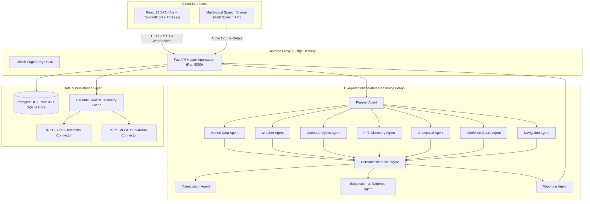

# NEREUS

Agentic Marine Intelligence & Safety Platform

> *"Ask the Ocean. Understand the Ocean. Navigate Safely."*

---

## Project

**NEREUS** is an Agentic AI-powered marine intelligence platform designed for conversational access to satellite Earth Observation, oceanographic, weather, and geospatial information. Tailored specifically for the Indian maritime domain (Bay of Bengal, Arabian Sea, and Indian Ocean), it bridges the gap between complex satellite/oceanographic telemetry and coastal communities, fishermen, maritime operators, and disaster relief authorities.

---

## SIH

- **Event**: Smart India Hackathon 2026
- **Problem Statement**: ORCA Marine EcoSystem Reasoning with Collaborative Agents
- **Problem Statement ID**: SIH26176
- **Team**: 353 / BOOYAH BUILDERS

---

## Main Features

- **Multi-Agent Marine Intelligence**: Autonomous 11-agent collaborative reasoning pipeline with deterministic safety gating.
- **Conversational AI**: Grounded in official INCOIS ocean advisories and live marine telemetry using Google Gemini.
- **Voice-First Interaction**: Full speech-to-text, real-time auditory answers, and voice replays powered by Edge-TTS.
- **Indic Language Support**: Natural communication in English, Telugu (తెలుగు), Hindi (हिन्दी), Tamil (தமிழ்), Malayalam (മലയാളം), Kannada (ಕನ್ನಡ), Bengali (বাংলা), Gujarati (ગુજરાતી), Marathi (मराठी), and Odia (ଓଡ଼ିଆ).
- **PFZ Discovery**: Potential Fishing Zone identification with geodesic distance, pelagic fish species, sea surface temperatures, and chlorophyll-a concentrations.
- **SST Analysis**: Continuous Sea Surface Temperature tracking across all Indian coastal sectors.
- **Chlorophyll Analysis**: Satellite chlorophyll-a density tracking indicating oceanic upwelling zones.
- **Weather Intelligence**: Live and forecasted wind speeds, wind directions, ambient temperatures, humidity, and barometric pressure.
- **Wave Analysis**: Douglas Sea Scale triage, Significant Wave Height ($H_s$), and swell period monitoring.
- **Tide Information**: High/low tide level tracking, tidal trends, and harmonic forecasts.
- **Cyclone & Lightning Alerts**: Real-time depression and cyclonic disturbance tracking with threat categorizations.
- **Geofencing & IMBL Warnings**: Geodesic proximity alerts to the International Maritime Boundary Line (IMBL) preventing accidental border crossings.
- **Marine Protected Area Warnings**: Real-time alerts when approaching sensitive marine reserves, coral sanctuaries, or restricted defence areas.
- **Safe Route Planning**: Waypoint corridor routing that circumvents shallow shoals, harsh swells, and restricted boundaries.
- **Spatial-Temporal Reasoning**: Geospatial topology checks using Shapely geometries and spherical trigonometry.
- **Explainable AI Evidence**: Multi-step transparent audit tree displaying the exact telemetry, data source, and logic behind every safety decision.
- **Interactive 4K Maps**: High-definition tactical maritime vector maps with 29+ active Indian coastal monitoring stations.
- **3D Marine Globe**: Centerpiece Three.js interactive 3D globe with dynamic camera choreography focusing on queried maritime zones.
- **Marine Data Visualization**: Color-coded Live Conditions Matrix (Harsh, Moderate, Safe) categorized by official INCOIS criteria.
- **Offline & Cache Capability**: Built-in 1-minute continuous cache synchronization with local storage persistence during intermittent offshore connectivity.

---

## Architecture



---

## Technology Stack

### Frontend
- **Framework**: React 18 with TypeScript
- **Bundler**: Vite 6
- **Styling**: TailwindCSS
- **3D Graphics & Animations**: Three.js, Lucide React
- **Audio & Voice**: Web Speech API, HTML5 AudioContext, Edge-TTS MP3 streams
- **Mapping**: Leaflet / React-Leaflet with 4K custom vector overlays

### Backend
- **Framework**: FastAPI (Python 3.12)
- **ASGI Server**: Uvicorn with uvloop
- **Validation**: Pydantic v2
- **AI & LLM Engine**: Google GenAI SDK (`gemini-3.6-flash`, `gemini-3.5-flash`)
- **Speech Synthesis (TTS)**: Microsoft Edge-TTS
- **Search & Research Grounding**: DuckDuckGo Search (`ddgs`)
- **Geospatial & Spatial Computing**: Shapely 2.0, Geodesic Spherical Trigonometry

### Database & Storage
- **ORM**: SQLAlchemy 2.0
- **Supported Databases**: PostgreSQL with PostGIS, SQLite 3 fallback
- **Caching**: Atomic JSON coastal telemetry store with 1-minute background updater

### DevOps & Containerization
- **Containerization**: Multi-stage production Dockerfile (`node:20-alpine` + `python:3.12-slim`)
- **CI/CD**: GitHub Actions (`.github/workflows/deploy.yml`)
- **Container Registry**: GitHub Packages (`ghcr.io/dev-nextenti/nereus:latest`)
- **Cloud Blueprints**: Render (`render.yaml`), Railway (`railway.json`), Docker Compose

---

## Project Structure

```
nereus/
├── .github/
│   └── workflows/
│       └── deploy.yml              # Automated CI/CD build, test & GHCR publish
├── backend/
│   ├── agents/                     # 11 Collaborative Marine Multi-Agents
│   │   ├── explanation.py          # Transparent reasoning evidence tree
│   │   ├── geofence.py             # IMBL and protected area boundary checks
│   │   ├── geospatial.py           # Shapely spatial distance & containment
│   │   ├── graph.py                # Pipeline orchestrator and dependency graph
│   │   ├── marine.py               # Satellite SST & Chlorophyll-a data
│   │   ├── navigation.py           # Safe route and waypoint corridor planning
│   │   ├── ocean.py                # Douglas Sea Scale & current analysis
│   │   ├── pfz.py                  # Potential Fishing Zone discovery
│   │   ├── planner.py              # User intent decomposition
│   │   ├── reporting.py            # Voyage safety dossiers and bulletins
│   │   ├── risk.py                 # Deterministic safety rule enforcement
│   │   ├── visualization.py        # 3D globe camera choreography
│   │   └── weather.py              # Wind, swell, and cyclone evaluation
│   ├── api/
│   │   └── routes/                 # REST & WebSocket API Routers
│   │       ├── alerts.py           # Maritime emergency alerts
│   │       ├── chat.py             # Multi-agent chat pipeline execution
│   │       ├── coastal.py          # 1-min live telemetry & station triage
│   │       ├── config.py           # Runtime API key & model settings
│   │       ├── marine.py           # Observation feeds
│   │       ├── navigation.py       # Safe passage routing
│   │       ├── ocean.py            # Douglas sea scales
│   │       ├── status.py           # Agent and platform diagnostics
│   │       ├── voice.py            # Speech recognition & synthesis
│   │       ├── voice_agent.py      # Gemini Live AI voice assistant
│   │       └── weather.py          # Weather point forecasts
│   ├── config/                     # Configuration and API key templates
│   │   └── api_keys.json.example   # Safe template for API keys
│   ├── data/
│   │   └── coastal_offline_cache.json # Live INCOIS coastal station cache
│   ├── data_ingestion/             # External marine connector interfaces
│   │   ├── connectors/             # INCOIS, MOSDAC, Open-Meteo, Copernicus
│   │   └── scheduler.py            # Periodic ingestion scheduler
│   ├── database/                   # Persistence Layer
│   │   ├── connection.py           # SQLAlchemy session engine (Postgres/SQLite)
│   │   ├── models.py               # Spatial and telemetry database models
│   │   └── seeds/
│   │       └── demo_data.py        # Deterministic Indian coastlines seed
│   ├── services/                   # Background Services & Voice
│   │   ├── coastal_updater.py      # 1-minute continuous INCOIS poller
│   │   ├── config_manager.py       # API key management with safe resolution
│   │   ├── online_research.py      # Live marine research grounding engine
│   │   └── voice/                  # Multilingual STT and Edge-TTS services
│   ├── main.py                     # Master FastAPI application & SPA mount
│   └── requirements.txt            # Python dependencies
├── frontend/
│   ├── public/                     # High-resolution 4K planetary textures
│   │   ├── _redirects              # Netlify/CDN proxy rewrites
│   │   ├── earth_4k_master.jpg     # 4K master terrestrial texture
│   │   ├── earth_night_4k.jpg      # Nocturnal illumination map
│   │   └── trident.svg             # NEREUS emblem
│   ├── src/
│   │   ├── components/             # UI Components
│   │   │   ├── chat/               # Conversational AI terminal
│   │   │   ├── globe/              # Three.js 3D marine globe & rings
│   │   │   ├── intro/              # Diagnostic system sequence
│   │   │   ├── layout/             # Mark-LI tactical holographic mainframe
│   │   │   ├── map/                # 4K Indian Ocean vector tactical map
│   │   │   ├── panels/             # Evidence tree, PFZ cards & weather HUD
│   │   │   └── voice/              # Multilingual AI Voice Agent modal
│   │   ├── lib/                    # Geometry, coast stations, sounds, themes
│   │   ├── types/                  # TypeScript interface definitions
│   │   ├── App.tsx                 # Master state & view controller
│   │   └── main.tsx                # Entry point & dynamic backend routing
│   ├── package.json                # Frontend packages & scripts
│   ├── tsconfig.json               # TypeScript compiler options
│   └── vite.config.ts              # Vite bundler configuration
├── .env.example                    # Environment variable template
├── .gitignore                      # Git ignore specification
├── docker-compose.yml              # Local container stack configuration
├── Dockerfile                      # Unified multi-stage production Dockerfile
├── Procfile                        # Cloud platform process declaration
├── railway.json                    # Railway deployment specification
├── render.yaml                     # Render Infrastructure-as-Code blueprint
├── requirements.txt                # Root Python dependencies
├── start_nereus.bat                # 1-click Windows startup script
└── start_nereus.ps1                # PowerShell launcher
```

---

## Installation

### Prerequisites
- Python 3.11+ or 3.12+
- Node.js 20+ and npm 10+
- Git

### 1. Clone the Repository
```bash
git clone https://github.com/dev-nextenti/NEREUS.git
cd NEREUS
```

### 2. Configure Environment Variables
Copy `.env.example` to `.env` and provide your Google Gemini API key:
```bash
cp .env.example .env
```
Edit `.env`:
```env
GEMINI_API_KEY=your_actual_gemini_api_key_here
PORT=8000
```

---

## Development

### Running the Backend (FastAPI)
```bash
# From project root
pip install -r requirements.txt
uvicorn backend.main:app --host 0.0.0.0 --port 8000 --reload
```
- Interactive API Docs (Swagger): `http://localhost:8000/docs`
- Health check: `http://localhost:8000/health`

### Running the Frontend (Vite + React)
```bash
cd frontend
npm install
npm run dev
```
- Frontend development server: `http://localhost:5173`

---

## Deployment

### Option 1: 1-Click Cloud Deploy (Render.com)
1. Open the [Render Deploy Blueprint](https://render.com/deploy?repo=https://github.com/dev-nextenti/NEREUS).
2. Connect your GitHub account and select this repository.
3. Provide `GEMINI_API_KEY` when prompted.
4. Render automatically builds the multi-stage Dockerfile and deploys the full-stack container on a permanent HTTPS domain.

### Option 2: Full Docker Container Stack
```bash
docker compose up --build -d
```
Access the application at `http://localhost:8000`.

### Option 3: GitHub Pages (Frontend Only)
The compiled frontend bundle can be deployed directly to GitHub Pages via the `gh-pages` branch, configured with dynamic backend routing to your deployed API server.

---

## API Endpoints

| Method | Endpoint | Description |
|---|---|---|
| `GET` | `/health` | Core health check (database, agents, telemetry) |
| `GET` | `/health/database` | Database connectivity verification and table records |
| `GET` | `/health/agents` | Status of all 11 active multi-agents |
| `GET` | `/api/info` | NEREUS platform metadata and coverage details |
| `GET` | `/api/coastal/live-summary` | Real-time INCOIS coastal station telemetry |
| `POST` | `/api/chat` | Execute complete 11-agent collaborative reasoning pipeline |
| `POST` | `/api/voice-agent/query` | Gemini Live voice query with synthesized Edge-TTS audio |
| `GET` | `/api/config/keys` | API key status and masking |
| `POST` | `/api/config/test-key` | Live Google Gemini API key validation |
| `GET` | `/docs` | OpenAPI / Swagger interactive documentation |

---

## Environment Variables

| Variable | Required | Description | Default |
|---|---|---|---|
| `GEMINI_API_KEY` | **Yes** | Google Gemini API Key from Google AI Studio | Encoded fallback |
| `PORT` | No | Server listening port | `8000` |
| `DATABASE_URL` | No | PostgreSQL/PostGIS connection string | `sqlite:///./nereus.db` |
| `VITE_API_URL` | No | Target API URL for standalone frontend builds | Same-origin |

---

## Team

**BOOYAH BUILDERS** (Team ID: 353)  
Smart India Hackathon 2026 — Ministry of Earth Sciences / INCOIS
